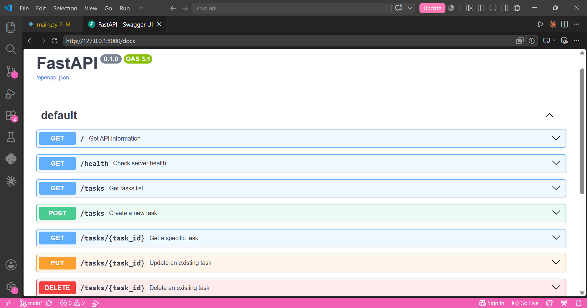

# Backend CRUD API

A simple CRUD Task API built using FastAPI for the FlyRank AI Internship assignment.

The API allows users to create, read, update and delete tasks while demonstrating REST API principles, HTTP status codes and input validation.

## Installation

Clone the repository

```bash
git clone https://github.com/YOUR_USERNAME/backend-crud-api.git
```

Move into the project

```bash
cd backend-crud-api
```

Install dependencies

```bash
pip install fastapi uvicorn
```

Run the server

```bash
uvicorn main:app --reload
```

Open

```
http://127.0.0.1:8000/docs
```

## Endpoints

| Method | Endpoint      | Description     |
| ------ | ------------- | --------------- |
| GET    | `/`           | API information |
| GET    | `/health`     | Health check    |
| GET    | `/tasks`      | Get all tasks   |
| GET    | `/tasks/{id}` | Get one task    |
| POST   | `/tasks`      | Create task     |
| PUT    | `/tasks/{id}` | Update task     |
| DELETE | `/tasks/{id}` | Delete task     |
| GET    | `/stats`      | Stats Info      |
| POST   | `/reset`      | Reset tasks     |

## Curl Output

Run:

```bash
curl -i http://127.0.0.1:8000/tasks
```

Output:

```text
HTTP/1.1 200 OK
date: Tue, 28 Jul 2026 12:49:14 GMT
server: uvicorn
content-length: 175
content-type: application/json

[
  {
    "id": 1,
    "title": "Complete the FlyRank AI Assignment",
    "done": false
  },
  {
    "id": 2,
    "title": "Farm 1000 Primogems in Genshin",
    "done": false
  },
  {
    "id": 3,
    "title": "Make dinner",
    "done": false
  }
]
```

## Swagger UI



## Mortality Experiment

After creating a new task and restarting the server, the new task disappeared and only the original seed tasks remained. This happened because the API currently stores tasks in an in-memory Python list, so all changes are lost when the server process stops; a database would provide persistent storage.

## AI vs Me
(I used Claude)

1. What did AI do better?

Claude used Pydantic field validators instead of validating titles inside endpoint functions, and it created helper functions such as find_task() and get_next_id(). 

2. What AI got wrong?

It omitted the GET /health and GET / endpoints. Its DELETE doesn't return a 204 No content response, instead it returns a success message

3. What my prompt forgot?

I didn't explain how task IDs should be generated, so the AI chose to reuse deleted IDs.
I didn't specify the initial seed tasks, so the AI created its own sample data.
I didn't explicitly define the exact response body for successful deletions, so the AI returned a JSON message.

Rematch:

After reviewing the first version, I updated my prompt to explicitly require the GET / and GET /health endpoints, a 204 No Content response for successful deletions, and sequential task IDs that are not reused.

## Pagination

The /tasks endpoint supports the limit and offset query parameters to return only part of the task list. Real APIs use pagination because returning every record at once can slow down responses, increase bandwidth usage, and consume unnecessary memory. Fetching data in smaller chunks makes applications more efficient and scalable.